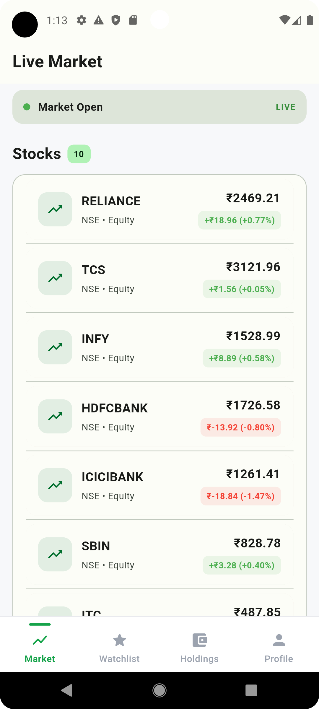
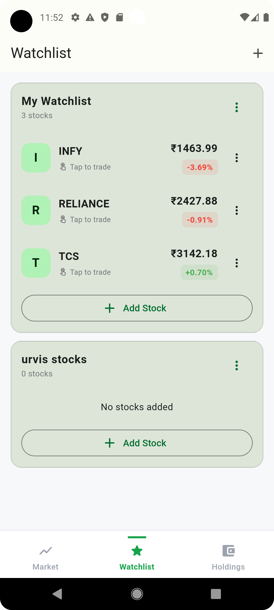
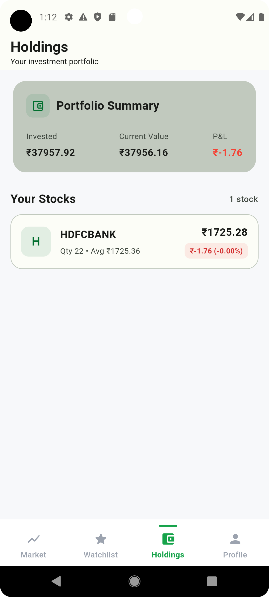
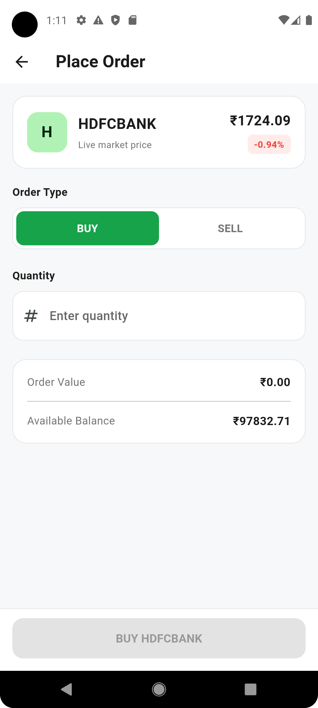

# TradeFlow

TradeFlow is a Flutter-based stock trading simulation app designed to demonstrate a modern trading application workflow with real-time simulated market price updates, watchlist management, holdings, and buy/sell order execution.

## 📱 Screenshots

| Market                                         | Watchlist |
|------------------------------------------------|-----------|
|  |  |

| Holdings                                          | Order                                        |
|---------------------------------------------------|----------------------------------------------|
|  |  |

## ✨ Features

- User authentication screens
- Stock market listing
- Real-time simulated stock price updates
- Price change flash animation
- Watchlist management
- Holdings and portfolio summary
- Buy and sell order flow
- Wallet balance management
- Order validation
- Local data persistence
- Responsive Flutter UI

## 📈 Market Simulation

TradeFlow uses a mock market data source to simulate live stock price movements.

- Stock prices update periodically
- Price changes are streamed through the application
- UI reacts to price updates using BLoC/Cubit
- Visual flash indicators highlight price changes

> This is a simulation project and does not connect to a real stock exchange or brokerage API.

## 🏗️ Architecture

The project follows a feature-based structure with separation between presentation, domain, and data layers.

```text
lib/
├── core/
│   └── constants/
│
├── data/
│   ├── datasources/
│   └── repositories/
│
├── domain/
│   ├── entities/
│   └── repositories/
│
├── features/
│   ├── authentication/
│   ├── holdings/
│   ├── home/
│   ├── market/
│   ├── trading/
│   └── watchlist/
│
└── injection/